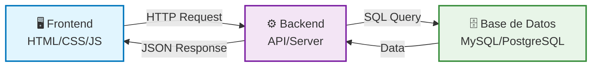

## Tema: Anatomía de una aplicación web moderna

**🎯 Objetivo:** Comprender los componentes principales de una app web (frontend, backend, base de datos).

## 1. Conceptos

### 🔹 Frontend
Es la parte visual de una aplicación web, con la que interactúa el usuario directamente. Se encarga de mostrar la información y recibir las acciones del usuario.

- **Tecnologías comunes**: HTML, CSS, JavaScript (React, Angular, Vue, etc.)
- **Ejemplo**: botones, formularios, menús, diseño general de la página.

### 🔹 Backend
Es la parte lógica del sistema. Procesa las peticiones del frontend, realiza cálculos, maneja la lógica del negocio y se comunica con la base de datos.

- **Tecnologías comunes**: Java, Node.js, Python, PHP, etc.
- **Ejemplo**: cuando haces login, el backend valida los datos con la base de datos.

### 🔹 Base de datos
Es el lugar donde se almacena la información de la aplicación. El backend consulta y guarda datos en ella.

- **Tipos**: 
  - Relacionales (SQL: MySQL, PostgreSQL)
  - No relacionales (NoSQL: MongoDB, Firebase)
- **Ejemplo**: una tabla con usuarios registrados y sus contraseñas (encriptadas).

---

## 2. Diagrama de Interacción Frontend-Backend-Base de Datos

